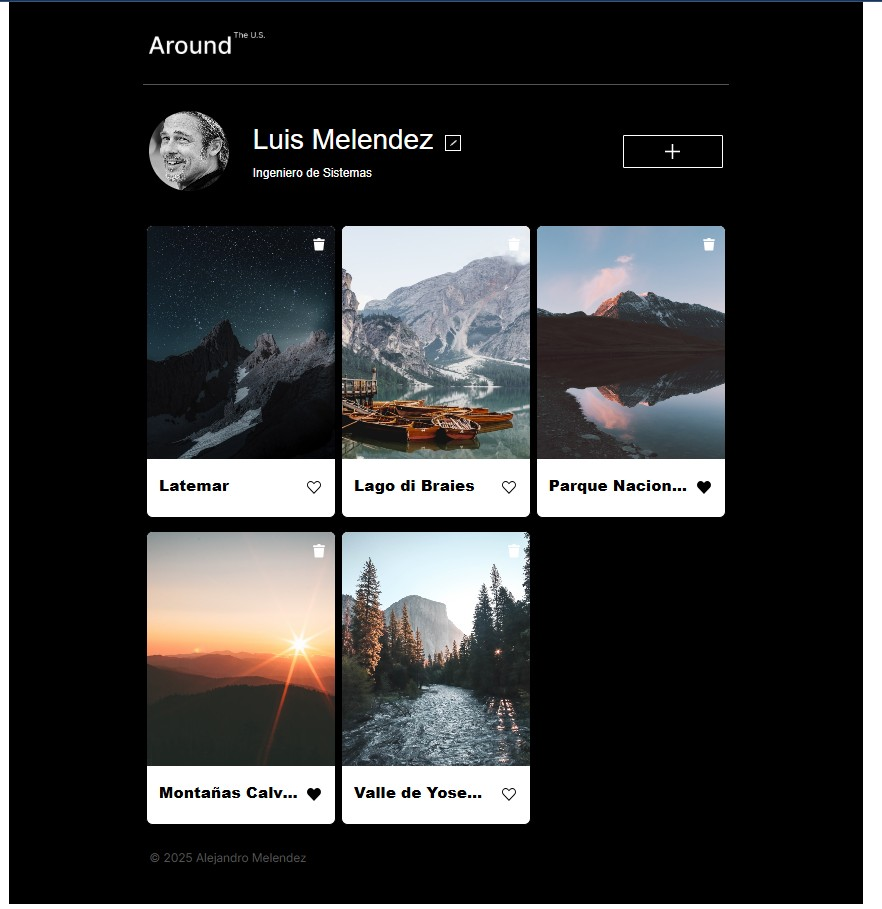

# 🗺️ Alrededor de los EE.UU. (Proyecto: Tripleten web_project_around)

## Alrededor de los EE.UU. es una aplicación web interactiva desarrollada con HTML, CSS y JavaScript puro. Permite a los usuarios gestionar su perfil, agregar tarjetas con imágenes, interactuar con ellas (dar "me gusta") y eliminarlas dinámicamente. El proyecto integra validación de formularios y una gestión eficiente del estado, todo implementado sin librerías externas para un control total del código.

## 📚 Tabla de Contenido

- [🎯 Objetivo del Proyecto](#-objetivo-del-proyecto)
- [🧰 Tecnologías Utilizadas](#-tecnologías-utilizadas)
- [⚙️ Funcionalidades Clave](#️-funcionalidades-clave)
- [🖼️ Captura de Pantalla](#️-captura-de-pantalla)
- [🎥 Video de Demostración](#-video-de-demostración)
- [🚀 Cómo Visualizar el Proyecto](#-cómo-visualizar-el-proyecto)
- [🧪 Mejoras Futuras](#-mejoras-futuras)
- [👨‍💻 Autor](#-autor)

## 🎯 Objetivo del Proyecto

Este proyecto fue creado como parte del curso de desarrollo web de TripleTen para aplicar conceptos esenciales de desarrollo front-end, incluyendo la manipulación del DOM, la validación de formularios y la programación orientada a objetos (POO) en JavaScript.

El proyecto se construyó con una arquitectura modular y escalable utilizando **HTML5** para la estructura semántica, **CSS3** para el diseño responsivo y **JavaScript (ES6+)** para toda la lógica interactiva.

**La arquitectura del proyecto se basa en los siguientes principios:**

- Manipulación dinámica del DOM para una experiencia de usuario reactiva.
- Creación y control eficiente de modales (ventanas emergentes).
- Validación avanzada de formularios con mensajes de error contextuales.
- Formularios interactivos con lógica modular y reutilizable.
- POO en JavaScript (clases como Card, FormValidator, Section, API, entre otras).
- Encapsulación y modularidad, asegurando código mantenible.
- Programación asíncrona con Promises, y fetch.
- Consumo de APIs REST.
- Uso de prototipos, constructores e herencia.

---

## 🧰 Tecnologías Utilizadas

- ✅ **HTML5** – estructura semántica clara.
- 🎨 **CSS3** – diseño responsivo y modular.
- ⚙️ **JavaScript ES6+** – modularidad, asincronía, clases, promesas y fetch.
- 🧩 **POO en JS** – clases, herencia y encapsulación.
- 🌐 **APIs REST** – comunicación cliente/servidor en tiempo real.
- 🔄 **Programación Asíncrona** – setTimeout, Promises, Promise.all.
- 🛠️ **Git & GitHub** – control de versiones y despliegue.

---

## ⚙️ Funcionalidades Clave

- ✏️ Edición del perfil con carga previa de datos.
- ➕ Añadir nuevas tarjetas (imagen + título) mediante formularios con validación.
- ❤️ Dar "me gusta" dinámicamente.
- 🗑️ Eliminar tarjetas de forma inmediata.
- 🔍 Ampliar imágenes con popups.
- 🧠 Validación modular de formularios.
- 🌐 Consumo de API REST para manejar datos de tarjetas/usuarios.
- 🔄 Fetch + Promises para obtener y enviar información a endpoints.
- 🏗️ Arquitectura modular y escalable basada en clases.

---

## 🖼️ Captura de Pantalla

### Vista principal

  

### Actualización de Perfil y Avatar

  

### ✨ Agregar, Eliminar, Dar Like y Ampliar Tarjetas

  

---

## 🎥 Video de demostración

  

---

## 🚀 Cómo Visualizar el Proyecto

Puedes ver el proyecto en acción aquí:
👉 [https://alejandrom21.github.io/web_project_around/](https://alejandrom21.github.io/web_project_around/)

---

## 🧪 Mejoras Futuras

- Uso de localStorage como cache offline.
- Subida de imágenes desde el dispositivo.

---

## 👨‍💻 Autor

Desarrollado por **Alejandro Meléndez**  
Proyecto académico realizado para **TripleTen - Programa de Desarrollo Web**.
